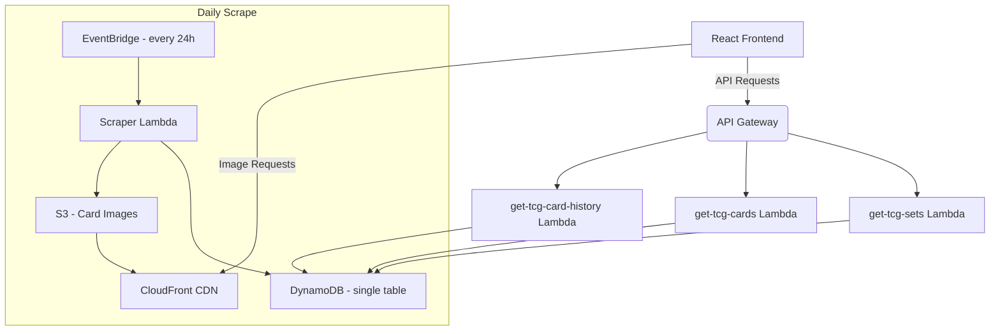

# 🃏 TCG Tracker – AWS Backend

Serverless backend for the **TCG Price Tracker**.  
Scrapes daily prices from [TCGRepublic](https://tcgrepublic.com), stores data in DynamoDB, serves it through REST endpoints, and delivers card images via CloudFront.

---

## 🏗 Architecture



---

## 🔌 API Endpoints

| Method | Path                                        | Description                                         | Lambda                   |
| ------ | ------------------------------------------- | --------------------------------------------------- | ------------------------ |
| `GET`  | `/card/{set_name}?card_id=ID&start_date=14` | Historical prices for a card (default 14-day range) | **get-tcg-card-history** |
| `GET`  | `/cards/{set_name}`                         | Latest data for every card in a set                 | **get-tcg-cards**        |
| `GET`  | `/sets/{tcg_name}`                          | All sets for a TCG                                  | **get-tcg-sets**         |

---

## 🗃️ DynamoDB – `tcg` (single-table)

| Item Type          | PK               | SK                                | Notes                           |
| ------------------ | ---------------- | --------------------------------- | ------------------------------- |
| **Set**            | `TCG#{tcg_name}` | `SET#{set_name}`                  | set metadata                    |
| **Card (latest)**  | `SET#{set_name}` | `CARD_LATEST#{card_id}`           | current metadata + latest price |
| **Card (history)** | `SET#{set_name}` | `CARD_HIST#{card_id}#{timestamp}` | price snapshot                  |

Queries:

- **All sets in TCG:** PK = `TCG#{tcg_name}`
- **All cards in set:** PK = `SET#{set_name}` + SK = `begins_with('CARD_LATEST')`
- **Price history of card:** PK = `SET#{set_name}` + SK = `between('CARD_HIST#{card_id}#{begin}', 'CARD_HIST#{card_id}#{end}')`

---

## 🖼️ Images (S3 + CloudFront)

- **Bucket:** `tcg-images`
- **Key format:** `card-images/{tcg_name}/{set_name}/{card_id}.jpg`
- Bucket is **private**; CloudFront OAC serves public requests.

---

## 🕑 Scraping Workflow

1. **EventBridge** triggers **scraper Lambda** daily.
2. Scrapy pulls data in parallel across sets.
3. Pipeline:
   - Insert set row when a new set appears.
   - Upsert `CARD_LATEST` (if changes detected).
   - Upload image to S3 if missing.
   - Append new `CARD_HIST` row.

Designed for minimal writes (two per card per scrape).

---

## 🔧 Environment Variables

| Key              | Example                                               |
| ---------------- | ----------------------------------------------------- |
| `DDB_TABLE_NAME` | `tcg`                                                 |
| `S3_BUCKET_NAME` | `tcg-images`                                          |
| `CLOUDFRONT_URL` | `https://<cloudfront-id>.cloudfront.net/card-images/` |

Create a `.env` locally based on `.env.example`; set the same values in each Lambda’s configuration.

---

## 💡 Cost Optimization Highlights

- **Single-table DynamoDB** avoids cross-table queries.
- Only **two writes per card per scrape** (latest + history).
- **CloudFront** caches images; **React Query** caches API responses (30 min) on the frontend.

---

## 🛠 Tech Stack

| Layer      | Tools              |
| ---------- | ------------------ |
| Scraping   | Python 3.9, Scrapy |
| Compute    | AWS Lambda         |
| Data       | DynamoDB, S3       |
| API        | API Gateway        |
| Scheduling | EventBridge        |
| CDN        | CloudFront         |

---

## 📁 Repo Structure

```
functions/
├── get-tcg-card-history/
├── get-tcg-cards/
├── get-tcg-sets/
└── scraper/          # Scrapy spider + pipeline
.env.example
requirements.txt
README.md
.gitignore
```

---

## 🙌 Credits

Created by **Sean Noh**
